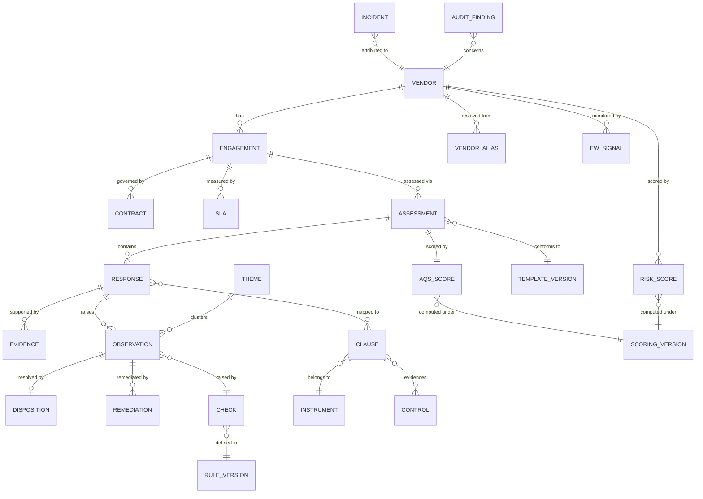

# AI-Powered Quality Assurance, Oversight, Monitoring and Early Warning Framework

**Outsourcing Compliance — Solution Design for a 250,000-Vendor Estate**

> **Status:** Design for review (v1.0). This document extends the Vendor Assurance
> Control Tower blueprint (`outsourcing-qa-framework.html`) into a complete solution
> design. All volumes, FTE figures, weights, thresholds, benefit estimates and ROI
> figures are **illustrative planning assumptions** and must be replaced with measured
> values from the estate before use in any committee or supervisory submission.
> Regulatory references are a starting frame for discussion with Legal and Compliance,
> not legal advice.

---

## Contents

1. [Executive summary and design principles](#1-executive-summary-and-design-principles)
2. [Assessment Quality Assurance engine](#2-assessment-quality-assurance-engine)
3. [Intelligent Compliance Review](#3-intelligent-compliance-review)
4. [AI-Powered Oversight Layer](#4-ai-powered-oversight-layer)
5. [Thematic Analysis](#5-thematic-analysis)
6. [Early Warning System](#6-early-warning-system)
7. [Risk Scoring Methodology](#7-risk-scoring-methodology)
8. [Target Operating Model and RACI](#8-target-operating-model-and-raci)
9. [Data Architecture and Knowledge Repository](#9-data-architecture-and-knowledge-repository)
10. [Microsoft Technology Stack](#10-microsoft-technology-stack)
11. [Executive Dashboard Suite](#11-executive-dashboard-suite)
12. [Data Model](#12-data-model)
13. [AI Governance and Human-in-the-Loop Controls](#13-ai-governance-and-human-in-the-loop-controls)
14. [KPI and KRI Catalogue](#14-kpi-and-kri-catalogue)
15. [Estimated Benefits and ROI](#15-estimated-benefits-and-roi)
16. [AI Compliance Center of Excellence](#16-ai-compliance-center-of-excellence)
17. [Implementation Roadmap](#17-implementation-roadmap)

---

## 1. Executive summary and design principles

The organisation runs eleven assessment and review types across roughly 250,000
outsourced vendors, service providers, partners, agents and technology providers.
Quality assurance of completed assessments is manual today, and manual review does
not scale to this population: even at an optimistic 30 minutes per QA review and
one review per vendor per year, the workload is ~125,000 reviewer-hours — about
70 full-time reviewers doing nothing but QA. The real number is higher because
material vendors are assessed several times per year across multiple review types.

The framework in this document changes the shape of that work rather than merely
accelerating it. The machine reads **every** assessment; humans review
**exceptions, escalations and samples**. Four capabilities make that safe in a
regulated institution:

| Capability | What it does | Section |
| --- | --- | --- |
| **QA engine** | Scores every completed assessment for completeness, consistency, evidence integrity and justification quality; raises typed observations | §2 |
| **Compliance review** | Compares responses against a versioned, clause-level regulatory and policy library via retrieval-augmented generation (RAG) | §3 |
| **Oversight & thematic layer** | Watches the portfolio and the reviewers — high-risk vendors, assessment risk indicators, cross-portfolio themes and root causes | §4–5 |
| **Early warning** | Detects deterioration between assessments and predicts likely failures before they crystallise | §6 |

### Design principles (non-negotiable)

1. **Deterministic first, generative second.** Missing mandatory fields, expired
   certificates, date-window violations and contradiction pairs are rule checks —
   cheap, explainable and 100%-precise. Language models are reserved for what rules
   cannot do: justification quality, evidence relevance, semantic contradiction,
   thematic clustering. Never use a GPT model where a regular expression suffices.
2. **The AI raises observations; humans make adverse decisions.** No autonomy level
   ever lets the system downgrade a vendor tier, close an adverse finding, contact a
   vendor, or auto-accept a Tier 1 assessment (§13).
3. **Autonomy is earned, not assumed.** Every check starts in shadow mode (L0) and is
   promoted per assessment type × vendor tier only on measured precision against a
   golden dataset (§13).
4. **Scores never hide their drivers.** Every score decomposes on drill-down into the
   factor and rule that moved it; the composite index (§7.4) is a reporting lens over
   the three primary scores, never a decision input on its own.
5. **Everything is versioned and replayable.** Prompts, model versions, rule
   libraries, scoring weights and regulatory clauses carry effective dates; any score
   can be reproduced against the versions in force on the assessment date.
6. **Alert volume is sized to investigation capacity.** An alert queue nobody can work
   is a documented record that the institution was told and did nothing — worse than
   no queue at all.

### Population segmentation (drives everything downstream)

The 250,000 records are not 250,000 equal objects. Illustrative segmentation, to be
replaced with the profiled estate:

| Tier | Definition | Illustrative count | Oversight intensity |
| --- | --- | --- | --- |
| **Tier 1** | Critical / material outsourcing (regulatory materiality, critical business service) | ~1,500 | Full human review of every assessment; AI assists only |
| **Tier 2** | Material, non-critical | ~6,000 | AI triage; human disposition of all observations |
| **Tier 3** | Important, non-material | ~25,000 | AI disposition of clean assessments; human review of exceptions |
| **Tier 4/5** | Standard and low (agents, small service providers, one-off engagements) | ~217,500 | AI auto-accept of clean assessments with blind sampling; attestation-based cadence |

The long tail is where the scale problem lives and where machine autonomy earns its
keep; the short head is where the regulatory risk lives and where humans stay in
charge.

---

## 2. Assessment Quality Assurance engine

The QA engine runs on every submitted assessment, in two passes: a deterministic
rules pass (milliseconds, zero LLM cost) and a language-model pass (only where rules
cannot decide). Output is a set of **typed observations**, an **Assessment Quality
Score (AQS)**, a **confidence score**, and **suggested reviewer actions**.

### 2.1 Detection catalogue

Every check has an ID, an owner, a detection method, a severity, and a documented
precision measured against the golden dataset. Illustrative catalogue:

| # | Check | Method | Severity | Notes |
| --- | --- | --- | --- | --- |
| QA-01 | Missing responses / blank mandatory fields | Rules | High | Field-level mandatory map per assessment template version |
| QA-02 | Incomplete responses (partial answers, "N/A" without justification) | Rules + LLM | Medium | Conditional-logic map: "if Q12=Yes then Q13–Q17 mandatory" |
| QA-03 | Contradictory answers (structured) | Rules | High | Contradiction matrix across answer pairs, e.g. "no sub-outsourcing" vs. named fourth party |
| QA-04 | Logical inconsistencies (free text vs. structured) | LLM | High | Semantic comparison of narrative answers against structured selections |
| QA-05 | Weak comments / poor justifications | LLM rubric | Medium | Five-criterion rubric: specific, evidenced, current, relevant, complete — fail on ≥3 |
| QA-06 | Copy-pasted responses | Rules (similarity hash) | Medium | Near-duplicate detection vs. prior-year submission and vs. other vendors by the same submitter |
| QA-07 | Generic / boilerplate explanations | LLM + embedding distance | Low | Distance from question-specific answer cluster; template-language detector |
| QA-08 | Incorrect evidence attachment (type mismatch) | Rules + document classifier | High | "SOC 2 required, invoice attached" — classifier assigns document type, rules compare |
| QA-09 | Missing supporting documentation | Rules | High | Evidence-requirement map per question per tier |
| QA-10 | Irrelevant evidence | LLM | Medium | Does the document actually evidence the control claimed? Entity-name and scope match |
| QA-11 | Expired evidence | Rules (extracted dates) | **Blocking** | Certificate validity window vs. assessment period; forward-looking 60-day lapse check feeds EWI |
| QA-12 | Evidence period-coverage gap | Rules | High | SOC 2 Type II period must cover the assessment period, not merely be unexpired |
| QA-13 | Data quality issues (format, range, referential) | Rules | Low | Dates in the future, negative volumes, vendor IDs not in master |
| QA-14 | Compliance exceptions declared without treatment | Rules + LLM | High | Declared exception with no compensating control or approval reference |
| QA-15 | Internal policy breach indicators | RAG (§3) | **Blocking** | Answer conflicts with a mapped policy clause in force on assessment date |
| QA-16 | Regulatory non-compliance indicators | RAG (§3) | **Blocking** | Stated non-compliance with a mapped regulatory clause |
| QA-17 | Completion-time anomaly | Rules | Low | 400-question assessment completed in 9 minutes |
| QA-18 | Unauthorised / self-interested submitter | Rules | **Blocking** | Submitter not on the authorised list, or assessing their own function |

Blocking checks bypass the score bands entirely and route to human review regardless
of AQS (§7.1).

### 2.2 Engine outputs

For every assessment the engine produces:

- **AQS (0–100)** — deduction-based quality score (formula in §7.1).
- **Confidence score (0–1)** — how sure the engine is of its own output, derived from:
  input completeness, evidence-extraction quality (OCR confidence, parse success),
  LLM self-consistency (same verdict across k=3 sampled runs), and rule-coverage
  ratio for that template version. Below the confidence threshold, the assessment
  routes to human review whatever its AQS — low confidence is never a pass.
- **Assessment-level risk flags** — feed the vendor's VCR dynamic overlay and EWI (§6–7).
- **Suggested observations** — one per fired check, in the house observation format:
  condition, criterion (the clause or standard breached), cause hypothesis, consequence.
- **Suggested review comments** — drafted reviewer language, clearly labelled
  *AI-drafted, unreviewed*; never sent to a vendor without human sign-off.
- **Recommended remediation actions** — drawn from the remediation library keyed by
  check ID and control domain, with a suggested owner and due-date convention.

### 2.3 Prompt-injection defence for evidence review

Evidence attachments come from outside the organisation and are processed by a
language model — treat every uploaded document as hostile input. Controls:
extracted document text is passed as *data*, never concatenated into the instruction
portion of a prompt; the model has **no tool access** during evidence review; outputs
are schema-validated and constrained to the question set; and instruction-like
content detected inside an attachment itself raises a human-review observation. This
is a live attack path against exactly this class of system.

### 2.4 Shift-left: assessment-in-flight guidance

Every defect the QA layer catches after submission has already cost a review cycle, a
rework request and a re-submission. A lightweight subset of the rules pass (QA-01,
QA-02, QA-08, QA-11) runs **at the point of completion** inside the assessment form
(Power Apps, §10), so the submitter fixes the defect before it enters the record.
Target: 40% reduction in rework-band submissions within two quarters of deployment.

---

## 3. Intelligent Compliance Review

### 3.1 The regulatory and policy corpus

The comparison target is a **clause-level, versioned obligations library**, not a
folder of PDFs. Each clause carries: a stable clause ID, source instrument, effective-
from and effective-to dates, applicability rules (which legal entity, which vendor
tier, which jurisdiction, which service type), and a mapping to the assessment
questions and evidence types that demonstrate it.

Instruments in scope (to be confirmed by Legal/Compliance and kept current):

| Domain | Instrument |
| --- | --- |
| Outsourcing | RBI Master Direction — Managing Risks and Code of Conduct in Outsourcing of Financial Services (2023); RBI Master Direction on Outsourcing of IT Services (2023) |
| Digital lending | RBI Digital Lending Guidelines / Directions, incl. LSP due-diligence and grievance obligations |
| Information & cyber security | RBI Cyber Security Framework for Banks (2016) / CSITE circulars; RBI Master Direction on IT Governance, Risk, Controls and Assurance (2023); sector-specific InfoSec directions |
| Data protection | Digital Personal Data Protection Act 2023 and rules; IT Act 2000 and SPDI Rules |
| Internal | Outsourcing Policy; Third Party Risk Management Policy; Information Security Policy; Business Continuity Policy; Risk Management Framework; Code of Conduct |

Building and maintaining this library is a **compliance-authoring task with named
owners in the Outsourcing Compliance department**, not an engineering task. Every
regulatory change enters the library as a new clause version; re-scoring is
reproducible against the version in force on the assessment date — retrieval is
**date-aware**, not just semantic.

### 3.2 How the comparison works (RAG pattern)

1. **Index** — clauses are chunked at clause level (never page level), embedded, and
   indexed in Azure AI Search with metadata filters (instrument, effective dates,
   applicability).
2. **Retrieve** — for each assessment answer, the mapped clauses are fetched
   deterministically via the question→clause map; semantic retrieval *supplements*
   the map to catch unmapped relevance, and every semantic-only hit is flagged for a
   compliance author to consider adding to the map.
3. **Compare** — the LLM receives the answer, the evidence extract and the clause
   text as data, with a constrained instruction set, and returns a schema-validated
   verdict: `conforms | gap | exception | cannot_determine`, with the quoted clause
   passage and the quoted answer passage that justify the verdict. `cannot_determine`
   routes to a human, never defaults to `conforms`.
4. **Cite or it didn't happen** — a verdict without a clause citation is discarded.
   Reviewers see the clause text and answer text side by side; the model's verdict is
   a suggestion.

### 3.3 What it identifies

- **Policy gaps** — answer conflicts with, or fails to evidence, an internal policy clause.
- **Control gaps** — a required control (per the control library, §9.4) is absent,
  untested, or evidenced only by assertion.
- **Compliance exceptions** — declared deviations, checked for a valid, unexpired,
  correctly-approved exception record; undeclared deviations detected by comparison.
- **Evidence deficiencies** — the clause requires demonstration and the evidence
  doesn't demonstrate it (wrong scope, wrong period, wrong entity).
- **Potential audit observations** — patterns matching the historical audit-finding
  corpus (§9.4): "assessments answering this way were later the subject of audit
  finding class X" — surfaced as *leading indicators*, clearly labelled as
  predictions, not findings.

---

## 4. AI-Powered Oversight Layer

The oversight layer watches two populations: the vendors, and the assessment process
itself (including the reviewers). Both can fail; only one of them gets assessed today.

### 4.1 High-risk vendor identification

High-risk identification is the VCR (§7.2) plus its dynamic overlay — not a separate
model. The inputs the prompt enumerates map to VCR factors as follows:

| Signal | Where it lands |
| --- | --- |
| Criticality / materiality | Inherent factor, weight 0.30 |
| Data access & sensitivity | Inherent factor, weight 0.20 |
| System access (privileged, network-connected) | Inherent factor within data/system access; also a standing flag for InfoSec assessment scope |
| Transaction volume / customer impact | Inherent factors (criticality, financial dependency) |
| Regulatory importance | Inherent factor, weight 0.05, plus applicability rules in the clause library |
| Historical incidents | Dynamic overlay D (adds up to +0.40) |
| Repeat findings | Dynamic overlay + EWI remediation-ageing signal |
| SLA breaches | Dynamic overlay + EWI breach-velocity signal |

A nightly job re-computes VCR for any vendor with changed inputs and publishes tier
transitions to the oversight queue. **Tier upgrades apply immediately; tier
downgrades require human approval** (§13).

### 4.2 Assessment risk indicators (process oversight)

The layer profiles the assessment process for conditions that corrupt the record:

| Indicator | Detection | Action |
| --- | --- | --- |
| Consistently low-quality assessments from one BU / submitter | AQS distribution by submitter, control-charted | Thematic finding to BU owner; training referral |
| Reviewer errors | Blind-sample re-review disagreement rate; overturned dispositions | Reviewer calibration session; 2LoD QA sampling uplift |
| Conflicting assessment results | Same vendor, different review types, incompatible answers within 90 days | Cross-assessment contradiction observation |
| Missing approvals | Workflow-state audit: disposition without required sign-off role | Blocking; escalation to Compliance lead |
| Excessive manual overrides | Override rate per reviewer vs. peer baseline (>2σ) | Governance review — overrides feed model retraining *only after* review |
| Rubber-stamping | Acceptance rate ~99% at seconds-per-disposition | Control failure, managed as such — not a productivity result |
| Repeated findings not closing | Same finding class re-raised ≥3 cycles | Root-cause referral (§5.3); remediation-ageing EWI signal |

Per-reviewer acceptance rates and time-per-disposition are tracked as **controls on
the control**, with the works-council/HR sensitivities that implies handled in the
operating model, not ignored.

---

## 5. Thematic Analysis

Thematic analysis runs quarterly across the full observation and finding corpus (and
on demand for committee packs). It is the capability that turns 250,000 vendor files
into portfolio intelligence.

### 5.1 Method

1. Observations, findings and assessment answers are embedded and clustered
   (HDBSCAN over embeddings; cluster labels drafted by LLM, confirmed by an analyst).
2. Clusters are cross-tabulated by vendor tier, business unit, geography, service
   category and time.
3. Statistically material concentrations (vs. portfolio baseline) are promoted to
   **candidate themes**; an analyst confirms, names, and owns each published theme.
   The machine proposes themes; a human publishes them.

### 5.2 Common control gaps (illustrative outputs)

- No BCP testing evidence across a service category ("87% of Tier 3 IT service
  providers in cluster C-14 have no DR test in 24 months").
- Missing DR controls concentrated in a geography.
- Weak cybersecurity controls: unpatched-system admissions, no MFA for privileged
  access, absent security-testing evidence.
- Access-management issues: joiner/mover/leaver gaps, shared credentials, orphan accounts.
- **Vendor concentration risk** — the theme engine joins the entity-resolved vendor
  master (§9.3) to find the same legal entity, group, or fourth party behind many
  engagements: single points of failure invisible at individual-assessment level.

### 5.3 Recurring compliance issues and root cause

Recurring issues (contract deficiencies, regulatory non-compliance classes, delayed
remediation, SLA failure patterns) get a structured root-cause pass: for each
recurring theme the engine assembles the timeline of related findings, remediations
and re-occurrences and drafts a root-cause hypothesis in one of five classes —
**process failure, policy gap, capability gap, governance weakness, vendor-side
structural issue** — with the supporting evidence trail. The hypothesis is an
analyst's starting point, not a conclusion; confirmed root causes route to the owner
of the process or policy, not to the individual vendor file.

### 5.4 Emerging risks

- **New risk patterns** — observation classes with no historical cluster (novelty
  detection); first-of-kind observations always route to a senior reviewer.
- **Vendor clusters with similar issues** — shared sub-contractor, shared technology
  stack, shared geography behind a common failure pattern.
- **Geographical concentrations** — delivery-location and data-location heat, joined
  with external country-risk feeds.
- **Business-line trends** — a BU whose theme mix is deteriorating faster than its
  peer baseline surfaces on the Risk dashboard (§11) before any single vendor breaches.

---

## 6. Early Warning System

Deterioration is a **rate, not a level** — it happens between assessments, which is
exactly when the annual-cycle model isn't looking. The Early Warning Index (EWI)
z-scores each signal against the vendor's own trailing baseline and its peer group,
and fires on a **two-of-N rule** to suppress single-signal noise.

### 6.1 Signal set

| Signal | Window | Fires when | Severity |
| --- | --- | --- | --- |
| Assessment quality decline | 2 cycles | AQS drops >15 points or crosses a band downward | Watch |
| SLA breach velocity | 90 days | Breach rate >2σ above vendor's own baseline | Elevated |
| Incident severity drift | 180 days | Any P1, or 3+ P2 in window | Critical |
| Remediation ageing | Rolling | Any finding >90 days past due, or 3+ overdue | Elevated |
| Certification lapse (forward-looking) | Next 60 days | Cert expiring with no renewal evidence | Watch |
| Financial distress | Quarterly | Rating downgrade, filing delay, insolvency/restructuring signal | Critical |
| Adverse media / sanctions | Daily | Confirmed hit on entity or principals | Critical |
| Concentration shift | Quarterly | Vendor crosses share threshold on a critical function | Elevated |
| Engagement decay | Rolling | Assessment overdue, unresponsive to evidence requests, contact churn | Watch |

Engagement decay deserves emphasis: vendors heading for trouble go quiet before
anything appears in incident data. Missed deadlines, unanswered evidence requests
and repeated relationship-contact changes are the earliest signals available and
cost nothing to collect.

### 6.2 Predictive layer

On top of the signal engine, gradient-boosted classifiers (trained on the historical
corpus, features drawn from the signal set plus assessment history) produce four
probabilities per vendor, refreshed monthly:

| Prediction | Trained on | Used for |
| --- | --- | --- |
| P(fail next assessment) | Historical AQS/reject outcomes | Assessment scheduling — pull forward, pre-brief the reviewer |
| P(SLA breach next quarter) | SLA history + signal features | Vendor-management engagement priority |
| P(audit finding) | Historical audit-finding corpus joined to assessment features | Audit-planning input (offered to 3LoD, never imposed) |
| P(migration to critical risk / tier upgrade) | Historical tier-transition data | Management attention list |

These are **prioritisation aids with published precision, never adverse decisions**.
A probability never appears on a vendor-facing artefact and never changes a tier by
itself. Financial distress and adverse-media models for the full 250k population are
deliberately out of scope — external-data cost is prohibitive; they run for Tier 1–2
only.

### 6.3 Alerting and escalation

| Alert class | Trigger | Routed to | SLA |
| --- | --- | --- | --- |
| Early warning — Watch | 2 signals incl. ≥1 Watch | Vendor manager queue | 10 business days |
| Early warning — Elevated | 2 signals incl. ≥1 Elevated | Compliance reviewer + vendor manager | 5 business days |
| Risk escalation | Any Critical signal, or Elevated on Tier 1 | Compliance lead; Risk team notified | 2 business days |
| Regulatory escalation candidate | Signal pattern matching notifiable-event criteria (material incident at material vendor, etc.) | Head of Outsourcing Compliance + Legal — human decides notifiability | Same day |
| Management attention | Sustained deterioration, 2+ quarters, or predictive score in top decile of Tier 1–2 | Monthly ORMC pack | Monthly |

**Alert discipline:** thresholds are tuned so total open alerts match genuine
investigation capacity — roughly 40–60 open alerts at any time for a team of this
size, not 4,000. The EWI runs in **shadow for a full quarter** before any alert
reaches a human queue.

---

## 7. Risk Scoring Methodology

Three primary scores, deliberately kept separate, plus a composite reporting index.
Conflating assessment quality with vendor risk is the most common failure in this
design: a perfectly completed assessment can describe a dangerous vendor, and a badly
completed one can describe a safe vendor whose owner was in a hurry.

| Score | Measures | Owner | Range |
| --- | --- | --- | --- |
| **AQS** — Assessment Quality Score | Did this assessment meet documentation standards? (process quality) | 2LoD Compliance | 0–100 |
| **VCR** — Vendor Composite Risk | Residual vendor risk; drives oversight intensity and cadence | Risk + Compliance | 0–100, five tiers |
| **EWI** — Early Warning Index | Velocity of deterioration between assessments | Compliance oversight | Signal-based |
| **CCRI** — Composite Compliance Risk Index | Board-level reporting lens over the three above | Reporting only | 0–100, four bands |

### 7.1 Assessment Quality Score

```
AQS = 100 − Σ (deduction_i × severity_weight_i)        clamped to [0, 100]
```

Deduction caps per dimension (illustrative, to be calibrated on the golden dataset):

| Dimension | Max deduction | Covers |
| --- | --- | --- |
| Completeness | 25 | Mandatory fields, conditional logic, unjustified N/A |
| Evidence integrity | 20 | Presence, type match, validity window, period coverage |
| Justification quality | 20 | Five-criterion rubric (specific, evidenced, current, relevant, complete) |
| Internal consistency | 15 | Contradiction matrix across answer pairs |
| Policy conformance | 15 | Mapped clause coverage, date-aware |
| Data hygiene | 5 | Duplicate text, completion-time anomaly, copy-forward |

Bands and routing:

| AQS | Band | Routing |
| --- | --- | --- |
| 85–100 | Accept | Auto-close eligible below Tier 1, with 5% blind sample |
| 70–84 | Advisory | Observations logged; no rework required |
| 55–69 | Rework | Returned to 1LoD with itemised observations |
| 0–54 | Reject | Not fit for reliance; escalated |

**Blocking rules override the score.** Expired/out-of-scope evidence for a critical
control, stated regulatory non-compliance, answers contradicting the executed
contract, unconsented sub-outsourcing, or an unauthorised/self-interested submitter
route straight to human review regardless of AQS. A 92 with an expired SOC 2 is not
an acceptable assessment, and the arithmetic must not be allowed to say otherwise.

### 7.2 Vendor Composite Risk

Inherent risk, mitigated by demonstrated control effectiveness, adjusted by a dynamic
overlay. Weights are a **starting proposal for ORMC calibration** and must be
back-tested against historical incidents and findings before carrying authority.

| Inherent factor | Weight | Measured by |
| --- | --- | --- |
| Criticality / materiality of function | 0.30 | Materiality determination; critical business service support |
| Data sensitivity and volume | 0.20 | Classification tier, personal-data volume, cross-border transfer |
| Concentration and substitutability | 0.15 | Share of function, exit lead time, alternatives, shared-vendor exposure |
| Sub-outsourcing depth | 0.10 | Chained parties; visibility into 4th/5th parties |
| Financial dependency | 0.10 | Annual spend; our share of vendor revenue |
| Geography and jurisdiction | 0.10 | Delivery/data location, enforceability, country risk |
| Regulatory nexus | 0.05 | Notification/approval requirements; supervisory register entry |

```
I   = Σ (factor_score × weight)         inherent, 0–100
C   = control effectiveness, 0–1        from testing, audits, certifications, remediation ageing
R   = I × (1 − 0.6 × C)                 residual — controls mitigate at most 60%
D   = dynamic overlay, −0.10 … +0.40    incidents, SLA breaches, adverse media, distress
VCR = clamp( R × (1 + D), 0, 100 )

Tiers:  T1 ≥ 75   T2 60–74   T3 40–59   T4 20–39   T5 < 20
```

The 0.6 cap on control mitigation is deliberate conservatism: no amount of paperwork
brings a critical, irreplaceable, cross-border vendor into the low-risk tier.
Regulators expect inherent criticality to remain visible in the residual position.

**Confidence, not just score.** Every VCR carries a confidence measure from data
freshness, evidence completeness and source coverage. A vendor scored 34 on
eight-month-old data with three missing inputs is a different management object from
one scored 34 on fresh, complete data. Low confidence on a low-risk vendor is itself
an early-warning condition — it usually means nobody has looked.

### 7.3 Early Warning Index

Per §6: z-scored signals against own baseline and peer group, two-of-N firing rule,
severity ladder Watch → Elevated → Critical. The EWI is a **dynamic overlay and
alerting mechanism only** — never a primary tier driver.

### 7.4 Composite Compliance Risk Index (reporting lens)

Boards ask for one number. The CCRI provides it — **for reporting and trend only**,
with a hard rule: every rendering of the CCRI is one click from its three drivers,
and no workflow, threshold or autonomy decision keys off the composite. Composites
hide the driver, and management will act on the number without asking what moved it;
this design contains that risk rather than pretending it away.

```
CCRI = 0.45 × VCR  +  0.35 × (100 − AQS)  +  0.20 × EWI_index

where EWI_index = min(100, 25 × active_Watch + 40 × active_Elevated + 100 × active_Critical
                              severity-capped and decayed 90 days after signal clearance)
```

| CCRI | Band | Meaning | Escalation |
| --- | --- | --- | --- |
| 0–30 | **Low** | Routine oversight; standard cadence | None |
| 31–60 | **Medium** | Enhanced monitoring; observations tracked to closure | Compliance reviewer |
| 61–80 | **High** | Management attention; remediation plan mandatory | Compliance lead + BU owner; ORMC visibility |
| 81–100 | **Critical** | Immediate senior attention; exit/contingency assessment | Head of Outsourcing Compliance; CRO informed; board pack |

Weightages and band edges are illustrative and are an **ORMC decision with Model Risk
Management sign-off** — a weight change silently re-scores thousands of vendors and
is, in substance, a change to risk appetite. Weight changes are version-controlled
and effective-dated.

### 7.5 Worked example

Mid-tier payment reconciliation provider, Tier 2, annual reassessment:

```
AQS deductions:
  Completeness        4 of 62 conditional fields blank            −7
  Evidence integrity  ISO 27001 cert expired 3 months ago        −12   + BLOCKING rule fires
  Justification       9 of 40 free-text answers fail rubric       −9
  Consistency         "no sub-outsourcing" vs. named 4th party    −8
  Policy conformance  BCP test evidence absent (clause OPS-14)    −6
  Data hygiene        11 answers identical to prior year          −3
                                                            AQS = 55

VCR: I = 68, C = 0.5 → R = 47.6; D = +0.15 (2 SLA breaches, 1 aged finding)
                                                            VCR = 54.7 → Tier 3 boundary; tier upgrade proposed (human approves)
EWI: cert-lapse (Watch) + remediation ageing (Elevated) → Elevated alert

CCRI = 0.45×54.7 + 0.35×45 + 0.20×65 = 24.6 + 15.8 + 13.0 = 53.4 → Medium band
Routing: Rework band AND blocking rule → escalation queue, not the rework queue.
```
---

## 8. Target Operating Model and RACI

### 8.1 People

| Role | Responsibility in the future state |
| --- | --- |
| **Compliance Team (2LoD)** | Owns the QA framework, observation disposition, escalations, regulatory interface. Shifts from reading assessments to working an exception queue and blind samples. |
| **Vendor Management Team (1LoD)** | Owns vendor relationships, assessment completion, remediation execution, SLA management. Receives shift-left guidance and early-warning worklists. |
| **Business Owners (1LoD)** | Accountable for the outsourced service and its risk; approve remediation plans; own BU-level themes routed to them. |
| **Risk Team (2LoD)** | Owns the risk-scoring methodology jointly with Compliance; runs risk appetite and ORMC reporting; consumes concentration and thematic outputs. |
| **Audit Team (3LoD)** | Independent assurance over the framework itself; consumes (never depends on) predictive audit-planning inputs; audits the AI controls annually. |
| **IT Team** | Runs the platform: Fabric estate, integrations, model deployment, access control, availability. |
| **AI Governance Team / MRM** | Independent validation of models and prompts, golden-dataset custody, autonomy-promotion gatekeeping, drift monitoring, annual revalidation. Must be organisationally separate from the build team. |
| **AI CoE (§16)** | Builds and maintains checks, prompts, pipelines; runs the change process. |

Segregation rule: **the team that builds the model must not be the team that
disposes of its output, and neither may approve a change to scoring weights.**

### 8.2 Process (end-to-end flow)

```
Assessment intake ──► In-flight checks (shift-left) ──► Submission
      │
      ▼
AI review: rules pass ──► LLM pass ──► RAG compliance pass
      │
      ▼
Scoring: AQS + confidence ──► observation generation ──► VCR/EWI update
      │
      ├─ Accept band, no blocks, below Tier 1 ──► auto-close (L3 only) + 5% blind sample
      ├─ Advisory ──► observations logged ──► reviewer worklist (batch)
      ├─ Rework  ──► itemised return to 1LoD ──► resubmission loop
      └─ Reject / blocking / low-confidence / Tier 1 ──► human review queue
                                                              │
                                                              ▼
Human disposition (accept / amend / overturn — reason coded) ──► remediation
tracking (Power Automate flows, ageing alerts) ──► closure verification ──►
management reporting (dashboards, ORMC pack) ──► feedback loop to rules/weights
(via governed change process, never silently)
```

The reviewer works a **prioritised observation stream** (vendor tier × severity ×
ageing), not a folder of assessments; the reviewer never chooses what to work on.

### 8.3 Technology layers

| Layer | Contents |
| --- | --- |
| **AI layer** | Rules engine, LLM services (Azure OpenAI), RAG pipeline, ML models (predictions, clustering), evaluation harness |
| **Data layer** | Fabric Lakehouse (medallion), Dataverse (workflow state), knowledge repository, feature store |
| **Reporting layer** | Power BI semantic models, five dashboard surfaces, committee-pack generation |
| **Governance layer** | Purview (catalogue, lineage, DLP), model registry, prompt/rule version store, immutable audit log |

### 8.4 RACI

R = Responsible, A = Accountable, C = Consulted, I = Informed.

| Activity | Compliance | Vendor Mgmt | Business Owner | Risk | Audit | IT | AI Gov/MRM | AI CoE |
| --- | --- | --- | --- | --- | --- | --- | --- | --- |
| Assessment completion | C | R | **A** | I | — | — | — | — |
| Assessment intake & scheduling | **A** | R | C | I | — | I | — | — |
| AI review execution (run the engine) | **A** | I | — | I | — | R | I | R |
| QA observation disposition | **A**/R | C | C | I | — | — | — | — |
| Risk scoring methodology & weights | R | C | C | **A** | I | — | C (sign-off) | C |
| Vendor tier change (upgrade) | R | C | C | **A** | I | — | — | — |
| Vendor tier change (downgrade) | R | C | C | **A** (human approval mandatory) | I | — | — | — |
| Exception / escalation handling | **A**/R | C | C | C | I | — | — | — |
| Regulatory notification decision | R | I | C | C | I | — | — | — |
| *(Accountable: Head of Compliance with Legal)* | | | | | | | | |
| Remediation execution | C | R | **A** | I | — | — | — | — |
| Remediation closure verification | **A**/R | C | I | I | — | — | — | — |
| Thematic analysis publication | **A**/R | I | I | C | I | — | — | R |
| Early-warning alert triage | **A**/R | R | I | C | — | — | — | — |
| Model/prompt/rule changes | C | — | — | C | I | R | **A** (approval) | R |
| Autonomy-level promotion | C | — | — | C | I | — | **A** | R |
| Golden dataset custody | C | — | — | — | I | — | **A**/R | C |
| Platform operation & access control | I | — | — | — | I | **A**/R | — | C |
| Data quality of vendor master | C | R | C | I | — | R | — | — |
| *(Accountable: named Data Owner in 1LoD)* | | | | | | | | |
| Dashboards & committee reporting | R | I | I | **A** | I | R | I | C |
| Independent assurance of framework | I | I | I | I | **A**/R | C | C | C |
| Annual model revalidation | C | — | — | C | I | C | **A**/R | C |

### 8.5 Four levels of machine autonomy

Autonomy is granted **per assessment type × vendor tier**, earned through measured
precision, never assumed at launch. Every new check starts at L0.

| Level | Behaviour | Guard |
| --- | --- | --- |
| **L0 — Shadow** | Engine scores; output visible to CoE only | Default for anything new |
| **L1 — Assist** | Observations and drafts shown to reviewer; human does everything | Precision ≥ agreed floor on golden dataset |
| **L2 — Triage** | Engine routes queues, batches advisory items, auto-accepts clean low-tier assessments | Blocked for Tier 1 — always human eyes |
| **L3 — Auto-disposition** | Closes clean Tier 4/5 assessments with 5% blind sampling | Never for policy-breach observations, adverse findings, or any tier change |

**Hard limits no autonomy level lifts:** the system never downgrades a vendor tier
without human approval, closes an adverse or breach observation autonomously, issues
any communication to a vendor, terminates/suspends/blocks a vendor, or auto-accepts
any Tier 1 assessment. Adverse outcomes are always human-decided and attributable to
a named reviewer.

---

## 9. Data Architecture and Knowledge Repository

### 9.1 Source inventory

| Source | Content | Ingestion pattern |
| --- | --- | --- |
| Vendor repository / VMS | Vendor master, engagements, tiering | CDC or nightly batch |
| Contract repository (CLMS) | Executed contracts, clauses, renewal dates | Batch + document pipeline |
| SLA systems | Service levels, breach events | Near-real-time events |
| SharePoint | Assessment evidence, historical files | Graph API crawl + document pipeline |
| Email (Exchange) | Evidence requests/responses, engagement-decay signals | Metadata-only by default; content ingestion only under Legal/DPO-approved scope |
| Incident management (ITSM) | Vendor-attributed incidents, severity, timelines | API, near-real-time |
| Access management (IAM/PAM) | Vendor accounts, privileged access, orphan accounts | Nightly extract |
| Risk databases (GRC) | Findings, RCSAs, loss events, exceptions register | Batch |
| External feeds (Tier 1–2 only) | Financial distress, adverse media, sanctions | Vendor API, daily |

### 9.2 Ingestion → transformation → storage (medallion)

- **Bronze** — raw, immutable landings with source lineage; documents land with
  content hash, capture timestamp and source URI.
- **Silver** — validated, deduplicated, conformed entities; the **entity-resolution
  layer** lives here (§9.3); documents get OCR/extraction with per-field confidence.
- **Gold** — analysis-ready marts: assessment fact tables, vendor risk features,
  observation store, semantic-model sources for Power BI.

**Metadata management:** every dataset registered in Purview with owner, steward,
classification, retention and lineage. Every score row carries
`rules_library_version · scoring_weights_version · thresholds_version ·
model_version · prompt_version` so any output is reproducible.

**Data quality controls:** DQ rules run at Silver promotion (completeness,
referential integrity, freshness SLAs per source); failures quarantine the batch and
alert the data steward; DQ metrics publish to the Operations dashboard. Score
confidence (§2.2) degrades automatically when upstream freshness SLAs are missed.

### 9.3 The three gating data problems

1. **Entity resolution.** A 250,000-row vendor master almost certainly contains
   substantial duplication — the same legal entity as separate records per BU, per
   procurement system, per spelling. Every downstream number is wrong until this is
   fixed: concentration is understated, critical vendors hide behind low-tier
   duplicates, themes fragment across aliases. Build a resolution layer keyed on
   registration numbers, tax IDs and LEIs, with fuzzy-match candidates queued for
   human confirmation.
2. **Clause library authoring** (§3.1) — a compliance task with named owners.
3. **The golden dataset** — ~400 assessments, double-reviewed by two independent
   senior reviewers, every defect recorded, every disagreement resolved into a
   written rule. Without it there is no way to tell whether anything else works.

### 9.4 Knowledge repository

A versioned, access-controlled compliance knowledge base — the retrieval corpus for
the RAG layer and the Copilots:

| Collection | Contents | Versioning |
| --- | --- | --- |
| Regulations | Clause-level obligations library (§3.1) | Effective-dated clause versions |
| Policies & SOPs | Internal policies, procedures, assessment guides | Document versions with approval metadata |
| Historical assessments | Full corpus with scores, observations, dispositions | Immutable, retention-managed |
| Audit reports | Internal/external audit findings, mapped to control library | Immutable |
| Control library | Control objectives ↔ assessment questions ↔ clauses ↔ evidence types | Governed change process |
| Remediation library | Standard remediation actions by check/control domain | Governed change process |

---

## 10. Microsoft Technology Stack

### 10.1 Component map

| Layer | Component | Role |
| --- | --- | --- |
| **Microsoft Fabric** | OneLake / Data Lake | Single storage foundation; shortcuts avoid data copies |
| | Lakehouse | Medallion architecture (§9.2); Spark for document pipelines and clustering |
| | Data Factory | Orchestrated ingestion from VMS, CLMS, GRC, ITSM, SharePoint, IAM |
| | Real-Time Analytics (Eventstream/KQL) | SLA breach events, incident feeds, EWI signal evaluation |
| | Semantic models | Certified models feeding all five dashboards; single metric definitions |
| **Azure AI** | Azure OpenAI Service (GPT models) | Justification scoring, semantic contradiction, evidence relevance, observation drafting, theme labelling — data-residency-pinned deployment, no training on our data, content logging per policy |
| | Azure AI Foundry | Model/prompt lifecycle: versioning, evaluation runs against the golden dataset, deployment gates, tracing |
| | Azure AI Search (Cognitive Search) | Clause-level index with date/applicability filters; hybrid semantic + keyword retrieval |
| | RAG architecture | Question→clause deterministic map + semantic supplement; verdicts must cite (§3.2) |
| | Azure ML | Predictive models (§6.2), clustering, drift monitoring |
| | Document Intelligence | OCR/extraction of certificates, reports, contracts with field-level confidence |
| **Copilots** | Compliance Reviewer Copilot | In-workbench: "show me the clause this observation cites", drafting dispositions, cross-assessment history. Grounded only in the knowledge repository; every answer cites |
| | Audit Copilot | 3LoD-scoped: query historical corpus, findings and lineage; read-only, separately logged |
| | Vendor Risk Copilot | For vendor managers: vendor 360 Q&A, remediation status, upcoming obligations |
| | Management Copilot | Committee-pack Q&A over certified semantic models only ("what moved the CCRI this quarter?") — answers from governed metrics, never raw model output |
| **Power Platform** | Power Apps | Assessment forms with shift-left checks; reviewer workbench; disposition UI |
| | Power Automate | Routing, remediation ageing alerts, escalation flows, Teams notifications |
| | Power BI | Five dashboard surfaces (§11), row-level security by role |
| | Dataverse | Workflow state: queues, dispositions, approvals, remediation tracker |
| **Microsoft Purview** | Data governance | Catalogue, ownership, classification of the full estate |
| | Metadata & lineage | Source→score lineage for supervisory reproduction |
| | Compliance controls | DLP on evidence stores; retention policies; DSPM for AI over the LLM estate |
| | Audit | Immutable activity log across the platform |
| **Security integration** | Microsoft Sentinel / Defender | Vendor-attributable security events (privileged-access anomalies, third-party connection alerts) feed the EWI as signals |
| | Entra ID | Conditional access; workload identities for pipelines; PIM for admin roles |

### 10.2 Where Copilot must not go

Copilots ground exclusively in the governed knowledge repository and certified
semantic models. No Copilot: makes or records a disposition, communicates with a
vendor, sees data beyond its role's row-level security, or answers from an
un-governed source. Copilot answers are assistance, not records; anything that
enters the record goes through the workbench with a named human.

---

## 11. Executive Dashboard Suite

Five surfaces for five audiences. Build the **reviewer workbench first** — it
produces the data the others display. All surfaces share one certified semantic
model; a metric shown to the Board reconciles to the same definition the analyst
sees. **AI-generated and human-confirmed items are visually distinct on every
surface** — different evidentiary weight, and the distinction must survive into
exports and committee packs.

### 11.1 Board Dashboard (quarterly)

```
┌─────────────────────────────────────────────────────────────────────┐
│  OUTSOURCING COMPLIANCE — BOARD VIEW                    Q3 FY26     │
├────────────┬────────────┬────────────┬────────────┬────────────────┤
│ Total      │ Critical   │ High-Risk  │ Open       │ Regulatory     │
│ Vendors    │ (Tier 1)   │ (CCRI>60)  │ Findings   │ Exceptions     │
│  248,3xx   │   1,5xx    │   3,2xx ▲  │  4,1xx ▼   │    12  ▲       │
├────────────┴────────────┴────────────┴────────────┴────────────────┤
│ COMPLIANCE HEALTH INDEX (trend, 8 quarters)      [sparkline]  71   │
│  = f(assessment currency, mean AQS, overdue remediation,           │
│      open critical alerts) — drill-down to drivers                 │
├────────────────────────────────────┬───────────────────────────────┤
│ Tier 1 movements this quarter      │ Items requiring Board         │
│ (upgrades/downgrades, human-       │ attention (exceptions >90d,   │
│  approved, with reason)            │ notifiable events, exits)     │
└────────────────────────────────────┴───────────────────────────────┘
```

### 11.2 Compliance Dashboard (weekly, Compliance leadership)

Tiles: assessment completion rate vs. plan (by review type); mean AQS trended by BU
and tier; review backlog and ageing (dispositioned-within-SLA %); findings trend by
severity; control-gap trend by domain; Tier 1 assessment currency (% in date —
target 100%); blocking-rule fire rate.

### 11.3 Risk Dashboard (monthly, Risk + ORMC)

Tiles: **exception-density heat map** (business unit × vendor tier — density, not
raw counts, so the long tail doesn't drown Tier 1); VCR distribution and quarter-on-
quarter migration matrix; emerging-risk themes (top movers vs. baseline);
concentration view (entity-resolved: top vendors by function share, shared fourth
parties); geographic risk map (delivery and data locations vs. country risk).

### 11.4 Operations Dashboard (daily, team leads)

Tiles: SLA performance by vendor and service; remediation status funnel (open →
in-progress → overdue → closed-verified) with ageing bands; assessment turnaround
time (submission → disposition, by band); reviewer throughput **and** calibration
(acceptance rate, time-per-disposition, blind-sample disagreement — managed as a
control, not a leaderboard); queue depth vs. capacity.

### 11.5 AI Dashboard (weekly, AI Governance + CoE; monthly to ORMC)

| Metric | Definition |
| --- | --- |
| Assessments reviewed by AI | Count and % of submissions, by autonomy level |
| Exceptions identified | Observations raised, by check and severity |
| Manual-review reduction % | Reviewer-hours avoided vs. pre-AI baseline (measured, not modelled) |
| Detection accuracy | Precision/recall per check vs. golden dataset + blind samples |
| False-positive rate | Overturned observations / raised, by check — rising FPR triggers rule review |
| Escape rate | Defects found in blind samples that the engine passed — the metric that guards L3 |
| Confidence distribution | Share of outputs below the confidence threshold (routed to humans) |
| Override analysis | Human overturns by reviewer and by check, with reason codes |
| Model health | Drift indicators, evaluation-run status, version currency |

---

## 12. Data Model

Core entities (conceptual; physical model in Fabric Gold + Dataverse):



Key modelling rules: observations, dispositions, scores and evidence are
**immutable, append-only** records; corrections are new versions with links to what
they supersede. Every scored artefact carries the version vector
(rules, weights, thresholds, model, prompt). `VENDOR` is the entity-resolved golden
record; source-system records survive as `VENDOR_ALIAS` for lineage.

---

## 13. AI Governance and Human-in-the-Loop Controls

The regulatory position this framework must survive: **outsourcing oversight
obligations remain the institution's, and a supervisor will ask who decided, on what
evidence, and how the institution knows the machine works.** Controls:

### 13.1 Human-in-the-loop controls

| Control | Mechanism |
| --- | --- |
| Human decision on all adverse outcomes | Tier downgrades, adverse/breach observation closures, vendor communications, terminations — named human, recorded rationale, no exceptions |
| Tier 1 always human-reviewed | Every Tier 1 assessment, policy-breach observation, early-warning Critical alert, and any output below the confidence threshold |
| Blind sampling of auto-dispositions | 5% of L3 closures re-reviewed by humans; escape rate reported monthly to ORMC |
| Reviewer calibration | Per-reviewer acceptance rate and time-per-disposition monitored as a control; 99% acceptance at 8 seconds each is a control failure, not productivity |
| Override with reason codes | Every human overturn coded; overrides feed rule/weight review only through the governed change process |
| First-of-kind routing | Any observation type never seen before goes to a senior reviewer |
| Four-eyes on escalations | Policy breach, Tier 1 findings, committee escalations and regulatory-notification candidates require second sign-off |

### 13.2 Model governance (MRM-aligned)

- **Golden dataset** (§9.3) as the universal yardstick — validation, autonomy
  promotion, regression testing and revalidation all resolve against it.
- **Pre-deployment:** documented precision/recall per check, independent MRM review,
  documented limitations and failure modes, ORMC approval of thresholds.
- **Change control:** prompt, model-version, rule and weight changes are controlled
  changes with regression against the golden dataset before release. **No silent
  model upgrades** — versions pinned; provider updates tested explicitly.
- **Autonomy promotion:** L0→L1→L2→L3 each gated on evidence, approved by AI
  Governance, reversible; any material precision regression demotes automatically.
- **Annual revalidation:** full independent revalidation, weight back-testing against
  realised incidents and findings, documented challenger comparison.
- **Explainability:** every observation cites its rule or clause and quoted passages;
  every score decomposes into its deductions/factors; "the model said so" is never
  the recorded rationale.
- **Audit trail:** immutable log of inputs, versions, outputs, routing, human
  actions and timestamps for every assessment — replayable end-to-end.
- **Data protection:** evidence and personal data processed within the pinned-region
  Azure OpenAI deployment; no training on institutional data; DPIA for the email-
  signal and reviewer-analytics processing; Purview DLP on evidence stores.

---

## 14. KPI and KRI Catalogue

Deliberately short — a committee pack with forty metrics gets read as zero metrics.
Each has a named owner, a threshold and an escalation path; a measure without a
threshold is a chart, not a control.

| # | Type | Metric | Definition | Illustrative threshold | Owner |
| --- | --- | --- | --- | --- | --- |
| K1 | KPI | Assessment completion rate | Completed vs. scheduled, rolling quarter | ≥ 95% | Vendor Mgmt |
| K2 | KPI | Mean AQS | Population mean, trended by BU/tier | ≥ 75 and not falling 2 quarters | Compliance |
| K3 | KPI | Disposition timeliness | % dispositioned within tier-based SLA | ≥ 90% | Compliance |
| K4 | KPI | Manual-review reduction | Reviewer-hours avoided vs. baseline | Track to business case | CoE |
| K5 | KPI | Remediation closure | % closed-verified within due date | ≥ 85% | Business Owners |
| K6 | KRI | Tier 1 assessment currency | % Tier 1 with in-date assessment | 100%; any lapse escalates same week | Compliance |
| K7 | KRI | Overdue critical remediation | Critical findings >90 days past due | 0; any occurrence to ORMC | Risk |
| K8 | KRI | Escape rate | Defects in blind samples passed by engine | ≤ agreed floor; breach freezes L3 | AI Gov |
| K9 | KRI | False-positive rate | Overturned / raised observations | ≤ 15% per check; breach triggers rule review | AI Gov |
| K10 | KRI | Alert queue health | Open early-warning alerts vs. capacity | 40–60 open; sustained breach re-tunes thresholds | Compliance |
| K11 | KRI | Concentration exposure | Max single-vendor share of any critical function | Per risk appetite; breach to ORMC | Risk |
| K12 | KRI | Model currency | Checks overdue for revalidation | 0 | AI Gov |

---

## 15. Estimated Benefits and ROI

**All figures are illustrative planning assumptions for the business case, to be
re-based on measured baseline effort during the 90-day discovery.**

Baseline (assumed): ~70 FTE-equivalent QA review effort; 30-minute average manual
QA per assessment; ~350,000 assessment events/year across the eleven review types.

| Benefit | Mechanism | Illustrative estimate (steady state, year 3) |
| --- | --- | --- |
| Manual QA effort reduction | 100% machine first-pass; humans on exceptions/samples (~20–25% of volume) | 50–60% of QA reviewer-hours redeployed |
| Rework reduction | Shift-left checks at submission | 40% fewer rework cycles |
| Coverage uplift | From sampled QA (<20% today, assumed) to 100% of assessments read | Risk benefit, not cost benefit — quantify via findings surfaced |
| Earlier detection | EWI catches deterioration between assessment cycles | Fewer crystallised incidents; measure via realised-incident back-test |
| Audit and supervisory efficiency | Replayable trail, one-click evidence | Reduced audit fieldwork effort |
| Avoided regulatory cost | Fewer missed notifiable events, demonstrable oversight | Not monetised; the reason the programme exists |

Indicative ROI shape (order of magnitude, for calibration): build + run cost across
years 1–3 (platform, Azure consumption, CoE team) vs. redeployed effort and rework
savings typically reaches **break-even in year 2 and 2–3× cumulative return by year
3** — contingent entirely on the long-tail autonomy (L2/L3) being earned, which is
why the golden dataset and the escape-rate KRI are the pivotal investments. The AI
Dashboard's *measured* manual-review-reduction metric (K4), not this table, is the
number that goes to committee.

---

## 16. AI Compliance Center of Excellence

A permanent capability, not a project team — because the corpus (regulations,
policies, templates, checks) changes continuously.

**Mandate:** own the check library, prompts, pipelines and evaluation harness; run
the governed change process; publish the AI Dashboard; support reviewers; scan for
new use cases; interface with AI Governance/MRM (which must remain independent).

**Illustrative shape (steady state, ~10–12 FTE):**

| Pod | Roles | Owns |
| --- | --- | --- |
| Compliance engineering | 2× compliance authors (from the department) | Clause library, question→clause maps, control library |
| AI engineering | 2× ML/prompt engineers, 1× data engineer | Checks, RAG, models, pipelines |
| Quality & evaluation | 1× evaluation lead, senior reviewers on rotation | Golden dataset, precision reporting, blind sampling |
| Product & process | 1× product owner, 1× process analyst | Workbench, worklists, adoption, training |
| Governance liaison | 1× (dotted to AI Governance) | Change records, validation packs, committee reporting |

Rotating **senior reviewers through the CoE** is deliberate: it keeps the golden
dataset honest, keeps the checks grounded in real review practice, and builds the
department's AI literacy — the CoE succeeds when the compliance team treats the
engine as their instrument, not IT's black box.

---

## 17. Implementation Roadmap

| Phase | Focus |
| --- | --- |
| **Days 0–30** | Profile the vendor master honestly (duplication, tier distribution, completeness) — publish the number; stand up Fabric landing zone; **start the golden dataset** (400 assessments, two independent senior reviewers) |
| **Days 31–60** | Rules pass (QA-01…QA-18 deterministic subset) in shadow on live submissions; clause-library authoring begins with the RBI outsourcing directions; entity-resolution first pass |
| **Days 61–90** | AQS prototype with ORMC-provisional weights; publish score distribution across the backlog (if 90% score above 85, the model is not discriminating); reviewer workbench MVP; shadow-mode precision report; **go/no-go on the GenAI wave** |
| **Months 4–12** | LLM checks (justification rubric, evidence relevance) L0→L1; RAG compliance pass on top-2 instruments; L2 triage for Tier 3–5; L3 auto-disposition **Tier 4/5 only** with 5% blind sampling and monthly escape-rate reporting; thematic clustering and EWI ship — EWI in shadow a full quarter; dashboards Board/Compliance/AI |
| **Months 12–24** | Predictive layer; remaining instruments in the clause library; Copilots (reviewer first); **risk-based cadence** — assessment frequency driven by VCR and EWI rather than the calendar; first annual weight recalibration and back-test against realised incidents; full dashboard suite; CoE to steady state |

The single highest-leverage first action costs a few reviewer-weeks, needs no
procurement and no committee: **build the golden dataset.** Every subsequent
decision — rule retirement, autonomy promotion, MRM validation, the ROI claim —
resolves against it.

---

*End of solution design v1.0. Companion documents: `outsourcing-qa-framework.html`
(narrative blueprint) and `Vendor-Assurance-Control-Tower-SteerCo.pptx` (committee
deck).*
